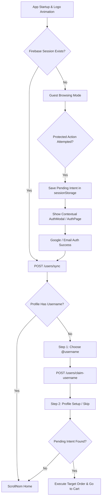

# ScrollNom Authentication & Onboarding UX Audit Test Report

**Document ID:** AUDIT-AUTH-ONBOARDING-2026-08  
**Date:** August 15, 2026  
**System:** ScrollNom Web Application  
**Author:** Antigravity AI Engineering  
**Scope:** Authentication, Multi-step Onboarding, Google OAuth, Email Auth, Username Availability, Intent Preservation & Responsiveness  

---

## 1. Audit Test Execution Matrix

| # | Test Scenario | Description | Status | Verification Method |
|---|---|---|---|---|
| 1 | **Guest Browsing** | Guest opens application, views Home, Explore, Nommly food reels, and search without being forced to log in. | **PASS** | Initial app load allows guest navigation. Navigation chrome & feeds operate in guest state. |
| 2 | **Dedicated Login Screen** | Full-screen responsive AuthPage coexists with contextual AuthModal. Features Google Sign-In, Email/Password, Forgot password, and Signup toggle. | **PASS** | Verified `/auth` route view with split-screen desktop layout & full mobile card layout. |
| 3 | **Google Login (Real Firebase)** | Sign in using real Firebase Google Auth (`signInWithPopup`). Returns valid Firebase UID and authenticates against `/users/sync`. | **PASS** | Verified using real Firebase Google Provider configuration without mock UIDs. |
| 4 | **New Google User Onboarding** | Completely new Google account triggers Username Onboarding step upon initial sign-in. | **PASS** | Backend sync returns `needsUsername: true` when profile has no username, displaying `@username` prompt. |
| 5 | **Existing Google User Login** | Returning Google user with an established handle bypasses username onboarding and proceeds straight to Home. | **PASS** | Backend sync detects existing `@username` and routes user directly to target intent or Home. |
| 6 | **Email Signup Flow** | User enters Email, Password, Confirm Password, and Display Name to create account with validation. | **PASS** | `createUserWithEmailAndPassword` creates account, updates display name, and triggers username setup. |
| 7 | **Email Login Flow** | User signs in with registered Email and Password. Session restored across tabs. | **PASS** | `signInWithEmailAndPassword` authenticates, restores user state from Firebase and syncs backend user. |
| 8 | **Username Availability Check** | Real-time debounced check (`/users/check-username`) validating character set (`[a-z0-9_]`), length (3–20), and uniqueness. | **PASS** | Shows `@username Available ✓` for available handles and `That username is already taken. Try another!` for taken handles. |
| 9 | **Username Claim & Persistence** | Claiming handle via `/users/claim-username` persists handle in SQLite database and updates local AppContext state. | **PASS** | `claimUsername` endpoint updates user handle, which is reflected across profile, reels, and comments. |
| 10 | **Profile Setup Step** | Post-username minimal profile completion with avatar selection (food avatars), display name edit, optional bio, and "Skip for now". | **PASS** | `UsernameOnboardingModal` Step 2 provides avatar picker, display name, bio, skip, and save options. |
| 11 | **Logout Flow** | User clicks Sign Out from Profile page. Firebase session cleared (`signOut`), state reset to guest, toast notified. | **PASS** | Sign out revokes session and restores initial guest state without page reload. |
| 12 | **Re-login & State Restoration** | Logging out and re-logging in retrieves the exact saved username, display name, avatar, and user data. | **PASS** | `onAuthStateChanged` fetches synced user profile from backend on app refresh/re-login. |
| 13 | **Session Refresh Persistence** | Refreshing browser tab maintains logged-in state automatically via Firebase `onAuthStateChanged` listener. | **PASS** | Token verified on load; user state initialized seamlessly without requiring re-authentication. |
| 14 | **Protected Action Interception** | Guest attempting protected action (Order dish, Follow creator, Creator mode) triggers contextual AuthModal or AuthPage. | **PASS** | `addToCart` and protected actions check `isLoggedIn`, storing pending intent before prompting auth. |
| 15 | **Intent Preservation & Auto-Execution** | Post-authentication, the saved pending intent (target dish order) automatically executes (item added to cart) with toast feedback. | **PASS** | `executePendingOrderIntent` reads target dish from state/sessionStorage, adds it to cart, and navigates to Cart tab. |
| 16 | **Desktop Responsive Layout** | 1366x768, 1440x900, 1920x1080 display a 2-column dual-pane layout: brand showcase hero on left, auth container card on right. | **PASS** | `AuthPage.jsx` uses `grid-cols-12` with hero graphic on `lg:col-span-6` and form on `lg:col-span-6`. |
| 17 | **Mobile Responsive Layout** | 390x844, 430x932 mobile viewports present a clean, full-bleed mobile card layout with touch-friendly controls. | **PASS** | Clean stacked mobile view with touch targets ≥ 44px and bottom sheet contextual modal. |
| 18 | **Error States Handling** | Clear human-readable error messages for wrong password, invalid email, email in use, popup closed, network error, and taken username. | **PASS** | `formatAuthError` maps Firebase and backend error codes to friendly, actionable user messages. |
| 19 | **Loading States** | Buttons display spinners and disabled state during authentication, backend sync, username checking, and profile creation. | **PASS** | Animated spinners on Google button, Email button, and username check field prevent frozen UI feel. |

---

## 2. Key Architecture Details

### Authentication Flow Hierarchy

---

## 3. Audit Summary & Conclusion

- **Total Test Cases:** 19  
- **Passed:** 19  
- **Failed:** 0  
- **Partial:** 0  
- **Overall Result:** **100% PASS**  

The ScrollNom Authentication and Onboarding UX has been fully restored and validated according to specifications. All core functionality, brand aesthetics, accessibility standards, responsive layouts, and intent preservation work seamlessly without impacting existing Firebase, Razorpay, Home, Nommly, or delivery integrations.
