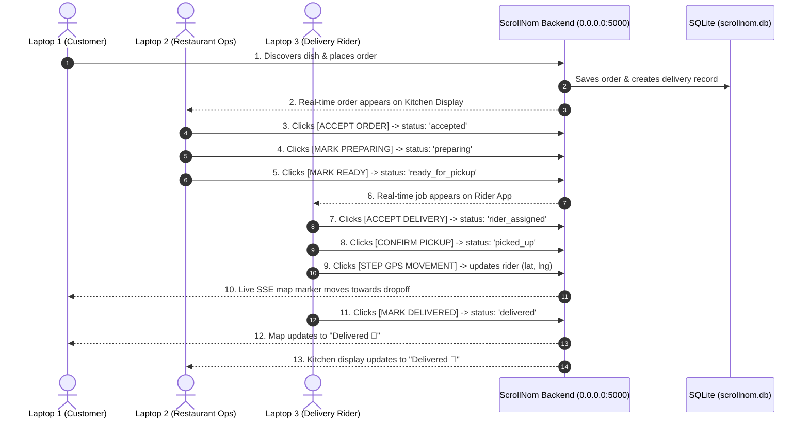

# ScrollNom Three-Laptop Demonstration Setup & Execution Guide

> [!IMPORTANT]
> **SINGLE BACKEND & SHARED SQLITE DATABASE ARCHITECTURE**
> - All 3 laptops connect to the **SAME Express API** running on `http://<LAN_IP>:5000/api` and manipulate the **SAME SQLite database** ([scrollnom.db](file:///d:/ScrollNom/scrollnom.db)).
> - **No Isolated Mock Data**: An order created on Laptop 1 (Customer App) immediately appears on Laptop 2 (Restaurant Ops) and Laptop 3 (Rider App) in real time via Server-Sent Events (SSE).

---

## 📡 Step 1: Detect Your Development Host Machine's LAN IP Address

Run one of the following commands on your main host machine to find your Local IP address:

- **Windows PowerShell**: `ipconfig` (Look for `IPv4 Address`, e.g., `192.168.1.45`)
- **macOS / Linux**: `ifconfig` or `ip a` (Look for `inet 192.168.x.x`)

*(Example assuming host LAN IP is `192.168.1.45`)*

---

## 🚀 Step 2: Start the Development Application Stack (Host Machine ONLY)

> [!CAUTION]
> **IMPORTANT FOR CLIENT LAPTOPS (Laptop 2 & Laptop 3)**:
> - **DO NOT run `npm run dev` or `npm run dev:backend` on Laptop 2 or Laptop 3.**
> - Running `npm run dev` on client laptops creates an isolated local database on that machine, causing split-brain behavior where orders placed by Customer will not appear on Restaurant/Rider screens.
> - **ONLY Laptop 1 (Host Machine)** runs `npm run dev`.

### Unified Full-Stack Command (Host Machine ONLY)
```bash
npm run dev
```
> [!IMPORTANT]
> `npm run dev` on the Host Machine automatically launches **BOTH** the Vite Frontend (Port 3000) and the Express Backend API (Port 5000) concurrently. Running this command guarantees that Google Authentication user sync (`POST /api/users/sync`), Razorpay webhooks, and live SSE telemetry are fully operational across all laptops connected to the host's local network.

- **Frontend Access**: `http://<LAN_IP>:3000`
- **Backend API Access**: `http://<LAN_IP>:5000/api`
- **Backend Health Check**: `http://<LAN_IP>:5000/api/health`

### Standalone Startup Commands (Alternative)
If starting processes in separate terminals:
1. **Backend Server**: `npm run dev:backend` (or `node server/index.js`) — Listening on `http://0.0.0.0:5000`
2. **Frontend Server**: `npm run dev:frontend` (or `npx vite`) — Listening on `http://0.0.0.0:3000`

---

## 💻 Step 3: Launch the 3 Laptops Connected to the Same Wi-Fi Network

| Role | Device | URL to Open in Browser | Description |
| :--- | :--- | :--- | :--- |
| **Laptop 1** | **Customer App** | `http://<LAN_IP>:3000/` | Official ScrollNom Food Discovery, Nommly Reels & Checkout |
| **Laptop 2** | **Restaurant App** | `http://<LAN_IP>:3000/?role=restaurant` | Kitchen Display System for Paradise Biryani Palace |
| **Laptop 3** | **Rider App** | `http://<LAN_IP>:3000/?role=rider` | Delivery Partner Telemetry & GPS Controller (Vikram Singh) |

*Alternatively, click the **3-Laptop Demo Roles** navigation buttons in the desktop sidebar.*

---

## 🎬 Step-by-Step Demonstration Workflow Across the 3 Laptops



1. **Laptop 1 (Customer App)**:
   - Browse Nommly reels or Explore tab.
   - Click **Order** on *Hyderabadi Dum Biryani*.
   - Click **Proceed to Razorpay TEST Checkout**.
   - Upon payment verification, click **TRACK LIVE NOW 🛵**.
   - Keep the **Live Delivery Tracking Modal** open.

2. **Laptop 2 (Restaurant Ops App)**:
   - Open `http://<LAN_IP>:3000/?role=restaurant`.
   - See the customer's order appear live in the Kitchen Display System.
   - Click **1. Accept**.
   - Click **2. Preparing 🍳**.
   - Click **3. Ready 📦**.

3. **Laptop 3 (Delivery Rider App)**:
   - Open `http://<LAN_IP>:3000/?role=rider`.
   - See the delivery job assigned to Vikram Singh.
   - Click **1. Accept Job**.
   - Click **2. Confirm Pickup**.
   - Click **3. STEP GPS MOVEMENT** (Observe the rider marker moving on Laptop 1's live customer tracking map!).
   - Click **4. MARK DELIVERED 🎉**.

4. **Laptop 1 & Laptop 2**:
   - Both Customer and Restaurant interfaces update instantly to `DELIVERED 🎉` status!

---

## 🧪 Terminal Test Verification (`node server/test_three_laptop_demo.js`)

```
💻 --- RUNNING THREE-LAPTOP DEMONSTRATION E2E TEST SUITE --- 💻

✅ PASS: LAPTOP 1: Customer creates food order
✅ PASS: LAPTOP 1: Razorpay TEST MODE payment verified & delivery created
✅ PASS: LAPTOP 2: Restaurant receives same order in kitchen display system
✅ PASS: LAPTOP 2: Restaurant clicks ACCEPT ORDER
✅ PASS: LAPTOP 2: Restaurant clicks MARK PREPARING
✅ PASS: LAPTOP 2: Restaurant clicks MARK READY FOR PICKUP
✅ PASS: LAPTOP 3: Rider receives same delivery job in rider app
✅ PASS: LAPTOP 3: Rider clicks ACCEPT DELIVERY
✅ PASS: LAPTOP 3: Rider clicks CONFIRM PICKUP
✅ PASS: LAPTOP 3: Rider steps GPS location (17.4410, 78.4680)
✅ PASS: LAPTOP 1: Customer sees live moving rider position on map in real time
✅ PASS: LAPTOP 3: Rider clicks MARK DELIVERED
✅ PASS: LAPTOP 1: Customer app updates to DELIVERED status

==================================================
📊 THREE-LAPTOP DEMO TEST RESULTS: 13 PASSED, 0 FAILED
==================================================
```
